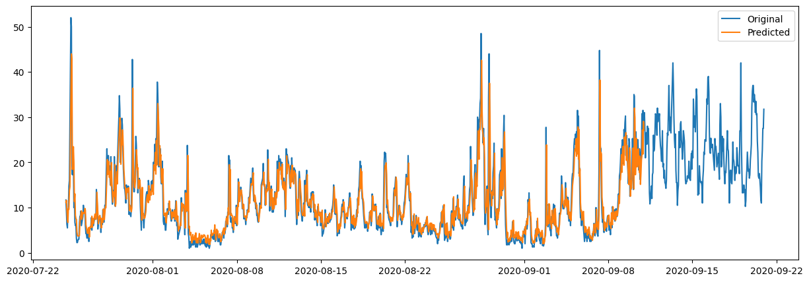
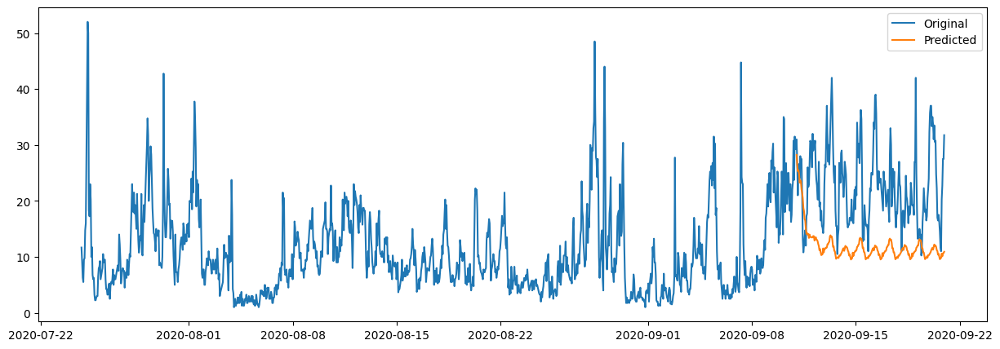

## CIA - 1 - IOT -> Paper Review

## CIA - 2 -> TSA Analysis

#### DataSet Used: Milan PM2.5 concentration from Kaggle
    Link: https://www.kaggle.com/datasets/wiseair/air-quality-in-milan-summer-2020?resource=download

    TSA done using ARIMA model and forecast obtained.

#### Predicted vs Original

    Inference: Works pretty well

#### Forecasted vs Original

    Inference: Model might need different parameters to work. For current parameters its not good enough.