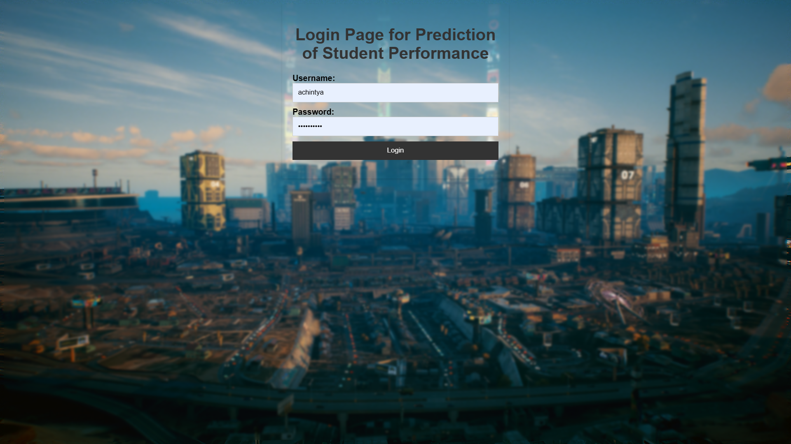
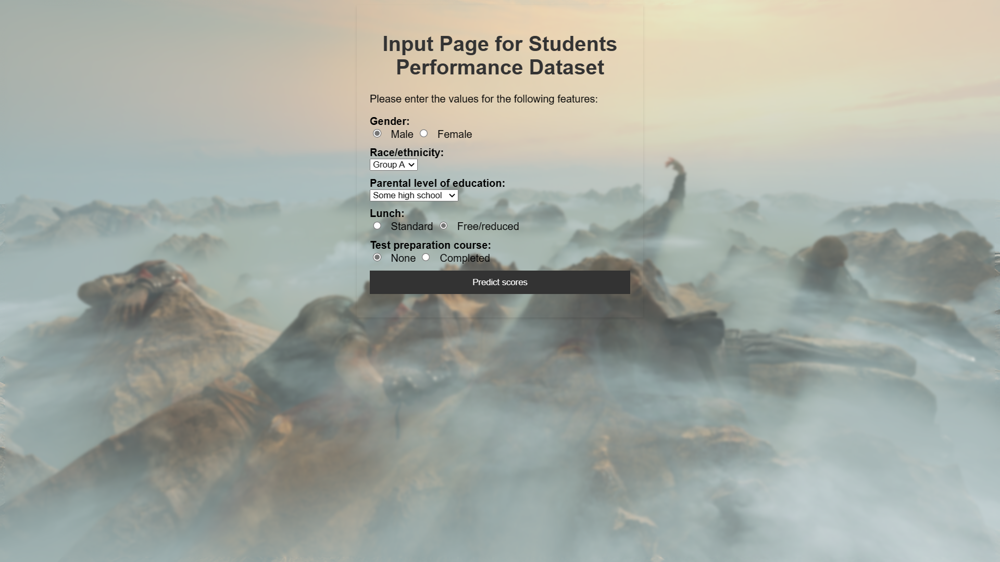
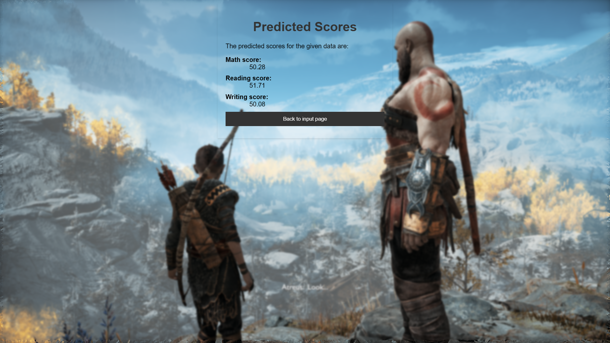

# 23_03_27_CIA2_MLT
 ## CIA2 Flask Application
 Prediction done using a simple 3-layered NN. (trained for 100 epochs)

 Dataset : https://www.kaggle.com/datasets/whenamancodes/students-performance-in-exams

 Final Model is stored in model.pth.

 Encoders as needed for the 5 categorical columns (gender, race, parental education, lunch status and test prep course) are stored as encoder 1 to 5 respectively.

 Templates contain respective HTML pages with CSS, static contains screenshots used as background images.

 ## Packages Used 
 Pytorch, Pandas, Numpy, Scikit-Learn, Flask, Pyodbc (For MS-SQL Connectivity)

 ## Login Page:
 

 ## Input Page:
 

 ## Output Page:
 
